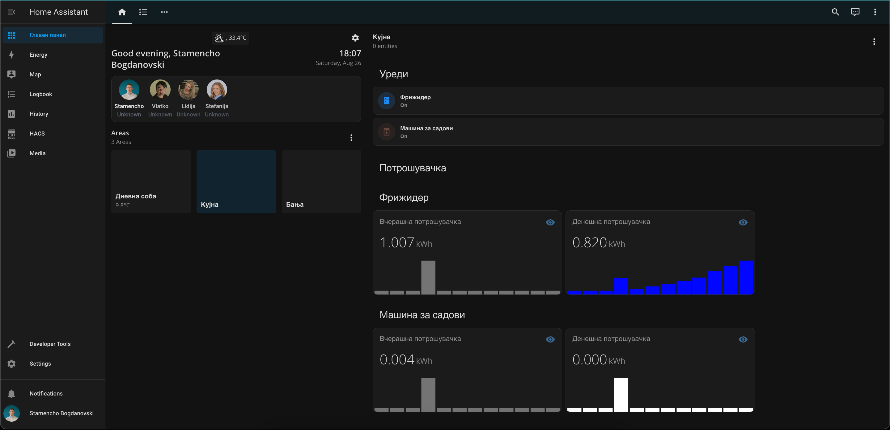
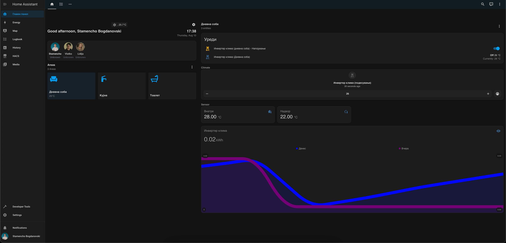
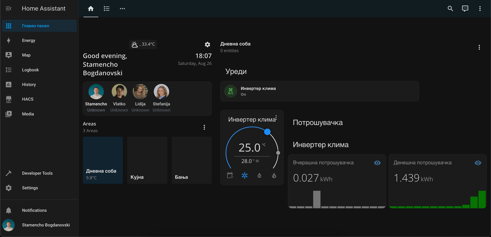
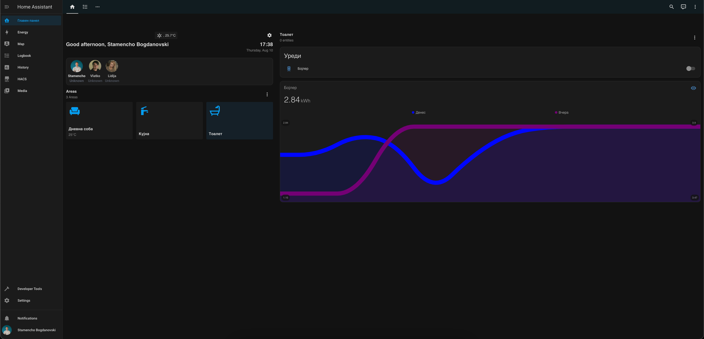
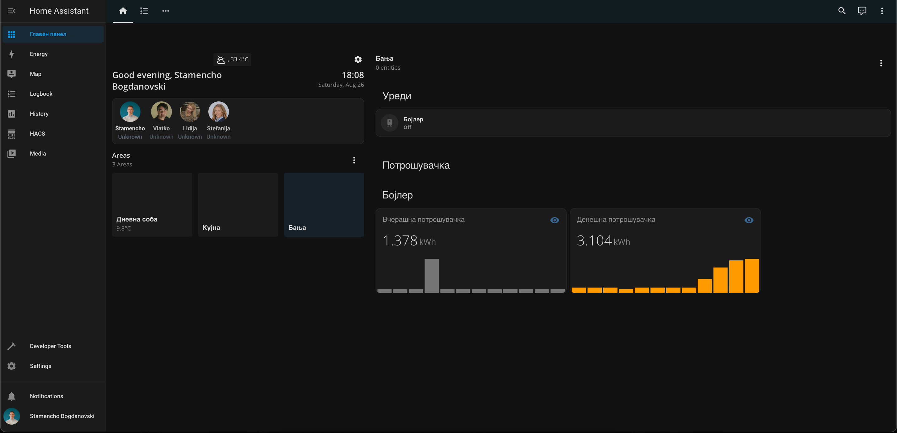
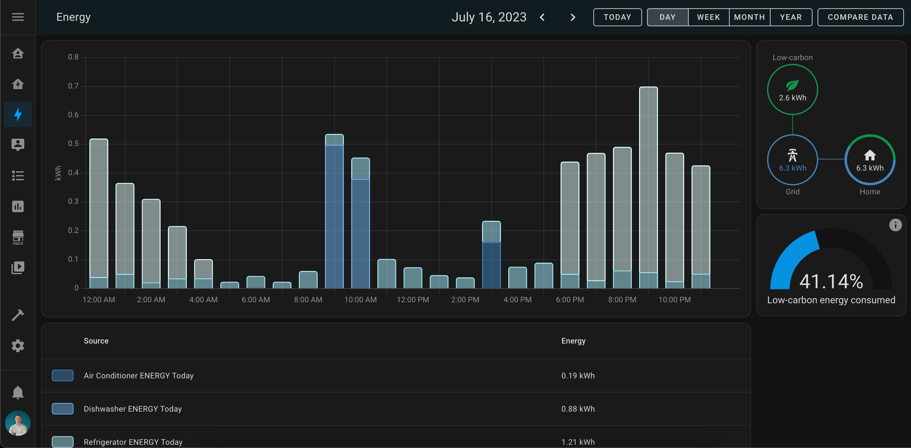
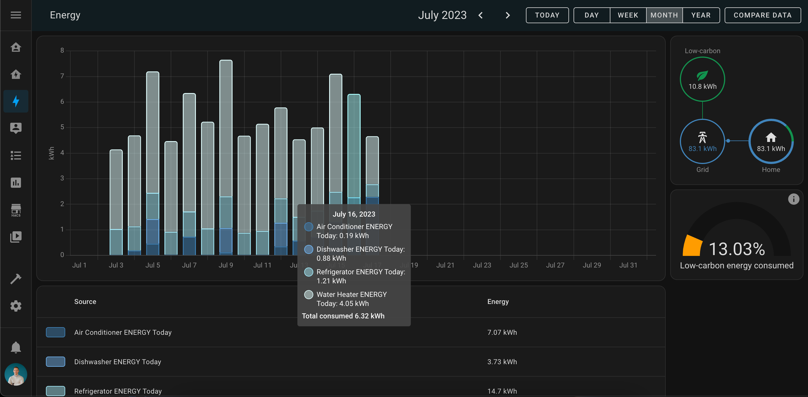

# Energy Monitoring System

This project was developed as a final undergraduate thesis/project in my BSc (Bachelor of Science) studies.

## Purpose and initiative

In the face of ongoing global challenges, such as climate change, resource scarcity, and environmental degradation, the integration of energy monitoring and home automation systems has become increasingly essential for a sustainable and resilient future.

- `Efficient Resource Management`: Real-time tracking of energy consumption allows for identifying wasteful practices and optimizing resource allocation, reducing costs and carbon footprints.

- `Cost Savings`: Data-driven insights empower homeowners to make informed decisions, leading to significant long-term savings amid economic uncertainty and energy price volatility.

- `Environmental Sustainability`: By curbing energy waste, we collectively mitigate greenhouse gas emissions and preserve natural resources, contributing to a greener planet.

- `Remote Accessibility and Safety`: Home automation provides remote access and control, ensuring safety during emergencies and limited physical presence.

- `Data-Driven Decision Making`: Energy monitoring offers valuable insights, enabling users to adopt energy-efficient practices and continuously improve.

- `Grid Stability and Demand Response`: Home automation supports grid stability by enabling demand response programs, balancing energy supply and demand.

In conclusion, the combination of energy monitoring and home automation not only brings immediate benefits like cost savings and energy efficiency but also addresses global challenges, fostering a sustainable future. Empowering individuals with smart technologies is key to creating a resilient and eco-friendly world for generations to come.

## Project

The Energy Monitoring System is a comprehensive setup that utilizes a Raspberry Pi 4 as a local area network (LAN) MQTT broker to collect and forward sensor data from devices running [Tasmota](https://tasmota.github.io/docs/) operating system to the cloud. The cloud infrastructure includes provisioned databases ([MariaDB](https://mariadb.com/kb/en/documentation/) and [InfluxDB](https://docs.influxdata.com/influxdb/v2.7/)) and the [Home Assistant](https://www.home-assistant.io/docs/) application, which processes and displays the received data in various formats, such as graphs and other informative visualizations.

The LAN broker and the Cloud infrastructure are securely connected using a zero-config VPN solution, [Tailscale](https://tailscale.com/kb/), which ensures encrypted communication between the two components. The communication is further secured by implementing username and password authentication.

## Project diagram

## Repository Overview

### Repository `Sensor Broker`

Repository: [Sensor data broker](https://gitlab.com/energy-monitoring-system/data_broker)

The `Sensor Data Broker` repository houses the code and configuration files for setting up the Raspberry Pi as a local MQTT broker. The device (RaspberryPi) is hardened and configured to be secure and only accessible from the local area network. The broker receives sensor data from Tasmota devices connected within the local network. It then securely forwards this data to the Cloud infrastructure for further processing and visualization. The code includes MQTT message handling, security mechanisms (username and password authentication), and connectivity with the Cloud infrastructure using Tailscale VPN.

For more information about this part of the project, check the following [documentation](https://gitlab.com/energy-monitoring-system/data_broker/-/blob/main/README.md) present in the same repository.

### Repository `External Systems`

Repository: [External Systems](https://gitlab.com/energy-monitoring-system/external-systems)

The `External Systems` Infra repository contains the necessary code and configurations for provisioning the cloud infrastructure. It includes scripts for setting up databases, deploying the Home Assistant application, and configuring the required services to receive and process data from the MQTT broker. The Cloud Infra repository ensures that data is efficiently stored and made accessible through graphical representations and other informative displays using Home Assistant.

For more information about this part of the project, check the following [documentation](https://gitlab.com/energy-monitoring-system/external-systems/-/blob/main/README.md) present in the same repository.

## Getting Started

To get started with the Energy Monitoring System and use the provided repositories, follow the steps outlined in the documentation in each of the repositories. The guide will lead you through setting up the LAN MQTT broker on a Raspberry Pi, configuring and provisioning the Cloud infrastructure.

## Screenshots and images

## Future improvements

 Below are listed improvement planned for the future:

- After the energy crisis in N. Macedonia caused by the war and the COVID-19 virus, the pricing for the energy was divided in the blocks (tariffs) that are based on the amount of energy used per household per month. This makes it complex to assign a static price of electricity, so I will need to figure out a way to implement this.

## Authors

- Stamencho Bogdanovski
  - Gitlab: [@sbogdanovski](https://gitlab.com/sbogdanovski)
  - Github: [@StamenchoBog](https://github.com/StamenchoBog)

## License

MIT License

Copyright (c) 2023 Stamencho Bogdanovski

Permission is hereby granted, free of charge, to any person obtaining a copy
of this software and associated documentation files (the "Software"), to deal
in the Software without restriction, including without limitation the rights
to use, copy, modify, merge, publish, distribute, sublicense, and/or sell
copies of the Software, and to permit persons to whom the Software is
furnished to do so, subject to the following conditions:

The above copyright notice and this permission notice shall be included in all
copies or substantial portions of the Software.

THE SOFTWARE IS PROVIDED "AS IS", WITHOUT WARRANTY OF ANY KIND, EXPRESS OR
IMPLIED, INCLUDING BUT NOT LIMITED TO THE WARRANTIES OF MERCHANTABILITY,
FITNESS FOR A PARTICULAR PURPOSE AND NONINFRINGEMENT. IN NO EVENT SHALL THE
AUTHORS OR COPYRIGHT HOLDERS BE LIABLE FOR ANY CLAIM, DAMAGES OR OTHER
LIABILITY, WHETHER IN AN ACTION OF CONTRACT, TORT OR OTHERWISE, ARISING FROM,
OUT OF OR IN CONNECTION WITH THE SOFTWARE OR THE USE OR OTHER DEALINGS IN THE
SOFTWARE.
